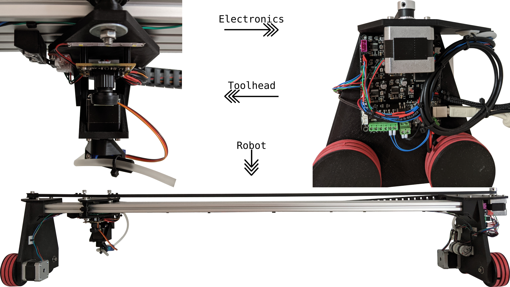
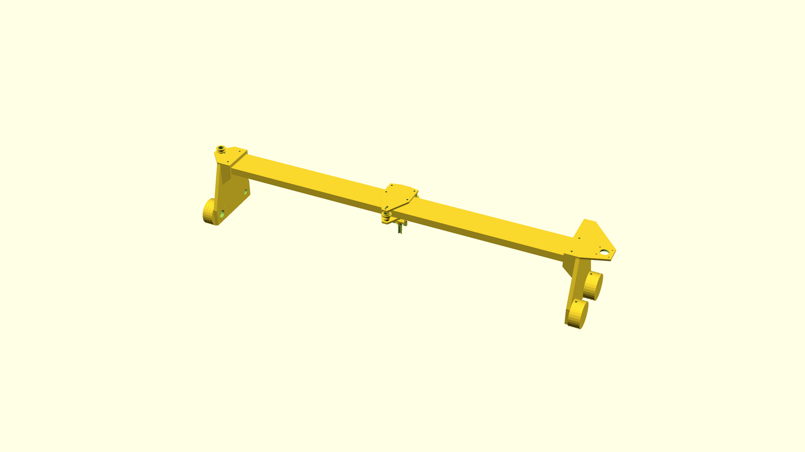

# jgswpzzlbt

## Overview

> Please keep in mind that this is a **very early work in progress**.

This is a jigsaw puzzle solving robot I'm designing. It is programmed in C++ using OpenCV for image recognition and LibSerial for communicating with a custom Arduino firmware.

## Dependencies

I generally try to minimize dependencies, but I'm a one man crew and can therefore only support Debian as I'm running it myself. Anyway, you need to have the following packages installed for everything to work properly:

- FreeCAD for editing and exporting the CAD file. Install it with `sudo apt install freecad`.
- A2Plus for assemblying to robot virtually in FreeCAD. Install it via the integrated addon manager.
- Arduino IDE as a way to compile the Arduino code. Install it with `sudo apt install arduino`.
- Code::Blocks as a C++ IDE. Install it with `sudo apt install codeblocks`.
- OpenCV as the used computer vision library. Install it with `sudo apt install libopencv-dev`.
- LibSerial as the used serial communication library. Install it with `sudo apt install libserial-dev`.

## How it works

The process of solving a jigsaw puzzle automatically involves the following six major steps:

1. Locating all the randomly positioned pieces.
2. Moving each piece to a known position inside a predefined matrix.
3. Creating detailed pictures of all the pieces.
4. Locating each piece in the provided overview picture of the puzzle.
5. Translating the digital positions to a real world ones.
6. Moving all the pieces to their final position.

## How to build it

jgswpzzlbt's mechanics mainly consist of a 1m long 20x80mm aluminium extrusion and some custom 3D printed parts. An assembly overview image can be found in `cad/assembly.png` as well as an assembly overview CAD model in `cad/assembly.FCStd`. But please don't expect any parts to fit perfectly or be easy to assamble as only one prototype has been build so far.

Below is a full bill of materials with German sources for all non printable parts:

| Quantity: | Item: | Source: |
| --- | --- | --- |
| 1 | MKS Base motherboard | [Amazon](https://www.amazon.de/Base-V1-6-RepRap-3D-Drucker-Steuerung/dp/B07G9K1T28) |
| 1 | HBV-1716WA USB camera | [Amazon](https://www.amazon.de/USB-Kameramodul-HBV-1716WA-Millionen-Weitwinkelobjektiv-OV2710-Chip/dp/B07QXXFGSM) |
| 1 | USB extension | [Amazon](https://www.amazon.de/deleyCON-Speed-Verl%C3%A4ngerungskabel-Stecker-Buchse/dp/B00WHZ7GBW) |
| 3 | NEMA 17 1.8deg stepper motor | [Amazon](https://www.amazon.de/STEPPERONLINE-Schrittmotor-63-74oz-4-Draht-Stepper/dp/B07MZJGNZN) |
| 1 | NEMA 11 1.8deg stepper motor | [Amazon](https://www.amazon.de/Iverntech-Schrittmotor-Schrittwinkel-3D-Drucker-CNC-Maschine/dp/B07PNV7RBW) |
| 1 | Power supply | [Amazon](https://www.amazon.de/Netzteil-Netzadapter-Transformator-Kaltger%C3%A4testecker-Streifen/dp/B07FNMKTBL) |
| 1 | SG90 micro servo | [Amazon](https://www.amazon.de/ARCELI-Flugzeug-Zubeh%C3%B6r-Arduino-Hubschrauber/dp/B07MY2Y253) |
| 1 | Endstop | [Amazon](https://www.amazon.de/GTIWUNG-Mechanischer-Endschalter-3D-Drucker-Makerbot/dp/B07VWRS24K) |
| 1 | Vacuum pump | [Amazon](https://www.amazon.de/KSTE-Vakuumpumpe-Mikrovakuumpumpe-Mini-Luftpumpe-Behandlungsinstrument/dp/B08BJWLKBW) |
| 1 | Vacuum tubing | [Amazon](https://www.amazon.de/JBL-Luftschlauch-Länge-Durchmesser-Aquaschlauch/dp/B000H6SRMU) |
| 1 | LED strip| [Amazon](https://www.amazon.de/Streifen-kaltwei%C3%9F-Streifenlicht-Lichtleiste-klebeband/dp/B00HSF65MC) |
| 1 | GT2 belt | [Amazon](https://www.amazon.de/OZUAR-Zahnriemen-3D-Drucker-Breite-Abstand/dp/B07D4GCYXW) |
| 1 | Cable ties and cable tie mounts | [Amazon](https://www.amazon.de/Hipeqia-Nylon-Kabelbinder-Kabelbinderhalter-Selbstklebend-Hitzebest%C3%A4ndig/dp/B08CL2JFCH) |
| 1 | Double sided tape | [Amazon](https://www.amazon.de/doppelseitiges-Klebeband-klebend-verschiedene-Breiten/dp/B00G6SCYCM) |
| 1 | Instant glue | [Amazon](https://www.amazon.de/Pattex-Sekundenkleber-L%C3%B6sungsmittelfreier-Gel-Kleber-Transparent/dp/B00O23B8IE) |
| 2 | 6.5x10mm spring for z axis | [Amazon](https://www.amazon.de/Kraftmann-9806-Federn-Sortiment-Druckfedern-Sortimentskasten/dp/B07WFPPXXX) |
| 1 | Cable chain | [Amazon](https://www.amazon.de/Haobase-Plastic-Towline-Cable-Chain/dp/B06XKZ35VH) |
| 1 | Cables | [Amazon](https://www.amazon.de/Donau-Elektronik-GMBH-Original-Kupfer/dp/B01BI1G88C) |
| 1 | Pin header | [Amazon](https://www.amazon.de/IZOKEE-Männlich-Stiftleiste-Buchsenleiste-Lochrasterplatine/dp/B07DBY753C) |
| 1 | Jigsaw puzzle mat | [Amazon](https://www.amazon.de/maDDma-Bastelfilz-Meterware-Taschenfilz-Filzstoff/dp/B0797QR4LL) |
| 1 | 110x120cm chipboard 8mm | [Globus Baumarkt](https://www.globus-baumarkt.de/spanplatte-roh-8-mm) |
| 40 | 3x12mm TX10 wood screw | [Globus Baumarkt](https://www.globus-baumarkt.de/detail/index/sArticle/27670/fs/116194815/sCategory/47135) |
| 1 | Aluminium profile 20x80 I-type slot 5 1000mm | [Motedis](https://www.motedis.com/shop/Aluprofile/20-I-Typ-Nut-5/Aluprofil-20x80-I-Typ-Nut-5::3798.html) |
| 10 | M5 t-nut I-type groove 5 | [Motedis](https://www.motedis.com/shop/Nutprofil-Zubehoer/In-der-Nut/Nutenstein-Glatt-I-Typ-Nut-5-M5::5846.html) |
| 1 | GT2 motor pulley 20 teeth, 5mm bore | [Motedis](https://www.motedis.com/shop/Dynamik/Zahnriemen-und-Zahnraeder/GT2-Riemenscheibe-20-Zaehne-5mm-Bohrung-fuer-6mm-Riemen::4248.html) |
| 10 | 625 2RS ball bearing | [Motedis](https://www.motedis.com/shop/Dynamik-Basiselemente/Kugellager/Rillenkugellager/Rillenkugellager-625-2RS-5x16x5::4290.html) |
| 4 | DIN 912 M2x20 screw | [Schraubenkasten](https://www.schraubenkasten.de/din-912-mit-innensechskant/m2-8-8-galvanisch-verzinkt-zylinderschraube_200581_13656) |
| 4 | DIN 934 M2x0.4 nut | [Schraubenkasten](https://www.schraubenkasten.de/muttern/sechskantmutter/din-934/edelstahl-a2_202500_23008) |
| 4 | DIN 912 M2.5x8 screw | [Schraubenkasten](https://www.schraubenkasten.de/din-912-mit-innensechskant/m2-5-8-8-galvanisch-verzinkt-zylinderschraube_200582_13676) |
| 30 | DIN 912 M3x8 screw | [Schraubenkasten](https://www.schraubenkasten.de/din-912-mit-innensechskant/m3-8-8-galvanisch-verzinkt-zylinderschraube_200583_13715) |
| 16 | DIN 934 M3x0.5 nut | [Schraubenkasten](https://www.schraubenkasten.de/muttern/sechskantmutter/din-934/edelstahl-a2_202502_23016) |
| 12 | DIN 912 M5x14 screw | [Schraubenkasten](https://www.schraubenkasten.de/din-912-mit-innensechskant/m5-8-8-galvanisch-verzinkt-zylinderschraube_200585_13871) |
| 5 | DIN 912 M5x25 screw | [Schraubenkasten](https://www.schraubenkasten.de/din-912-mit-innensechskant/m5-8-8-galvanisch-verzinkt-zylinderschraube_200585_13883) |
| 3 | DIN 912 M5x50 screw | [Schraubenkasten](https://www.schraubenkasten.de/din-912-mit-innensechskant/m5-8-8-galvanisch-verzinkt-zylinderschraube_200585_13899) |
| 14 | DIN 934 M5 nut | [Schraubenkasten](https://www.schraubenkasten.de/muttern/sechskantmutter/din-934/edelstahl-a2_202504_23024) |
| 3 | DIN 7349 M5 washer | [Schraubenkasten](https://www.schraubenkasten.de/scheiben/unterlegscheiben/din-7349-schweren-spannstift/5-3-din-7349-scheiben-schrauben-mit-spannstifte-a2-edelstahl_203612_23840) |
| 9 | Cable clip | 3D printer |
| 8 | Cable tie mount | 3D printer |
| 1 | C axis motor mount | 3D printer |
| 8 | Puzzle mat clamp | 3D printer |
| 1 | Vacuum tube guide | 3D printer |
| 1 | X axis bottom carriage | 3D printer |
| 4 | X axis camera spacer | 3D printer |
| 1 | X axis motor mount | 3D printer |
| 1 | X axis pulley | 3D printer |
| 1 | X axis pulley mount | 3D printer |
| 1 | X axis pulley spacer | 3D printer |
| 3 | X axis roller | 3D printer |
| 6 | X axis roller spacer | 3D printer |
| 1 | X axis stop | 3D printer |
| 1 | X axis top carriage | 3D printer |
| 2 | Y axis carriage | 3D printer |
| 4 | Y axis gear | 3D printer |
| 12 | Y axis track | 3D printer |
| 1 | Z axis carriage | 3D printer |
| 1 | Z axis mount | 3D printer |
| 1 | Z axis servo mount | 3D printer |

All parts were printed on my Sovol SV01 in standard PLA with a custom super fast profile. The following settings have been used with great success:

- 0.3mm layer height
- 0.6mm line width
- 1.2mm wall thickness
- 0.9mm top/bottom tickness
- 20% line infill
- 215°C nozzle temperature
- 60°C build plate temperature
- 75mm/s print speed (37.5mm/s for the initial layer, 75mm/s for infill, 37.5mm/s for walls, 120mm for travel)
- 100% cooling from the second layer on
- Zig zag support and 5mm raft, where necessary
