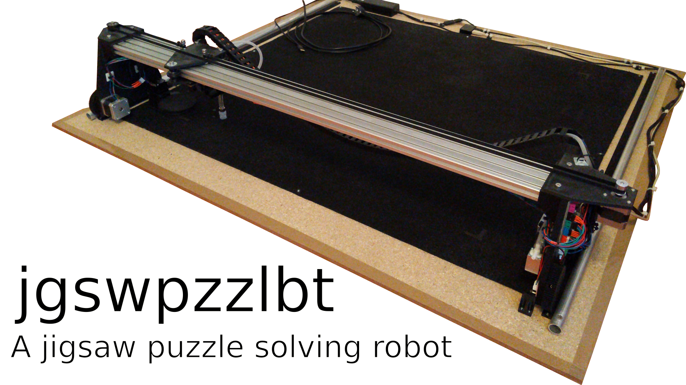
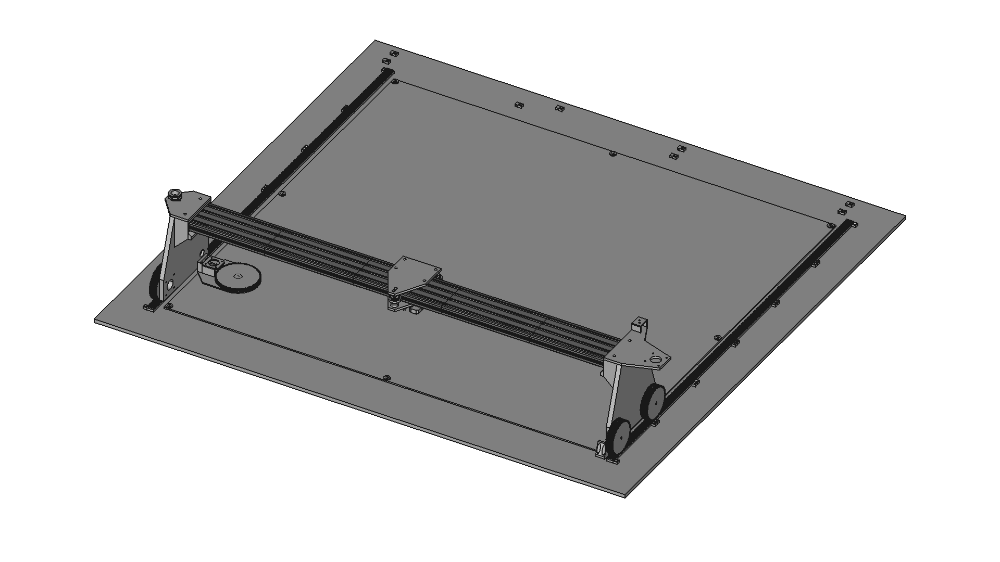

# jgswpzzlbt

## Overview

> Please keep in mind that this is a **very early work in progress**.

This is a jigsaw puzzle solving robot I'm designing. It is programmed in C++ using OpenCV for image recognition and LibSerial for communicating with a custom Arduino firmware.

## Dependencies

I generally try to minimize dependencies, but I'm a one man crew and can therefore only support Ubuntu based Linux distributions as I'm running Linux Mint myself. Anyway, you need to have the following packages installed for everything to work properly:

- OpenSCAD for rendering the CAD files. Install it with `sudo apt install openscad`.
- Arduino IDE as a way to compile the Arduino code. Install it with `sudo apt install arduino`.
- Code::Blocks as a C++ IDE. Install it with `sudo apt install codeblocks`.
- OpenCV as the used computer vision library. Install it with `sudo apt install libopencv-dev`.
- LibSerial as the used serial communication library. Install it with `sudo apt install libserial-dev`.

## How it works

The process of solving a jigsaw puzzle automatically involves the following seven major steps:

1. Locating all the randomly positioned pieces.
2. Moving each piece to a known position inside a predefined matrix.
3. Creating detailed pictures of all the pieces.
4. Stitching all the pictures together to construct the final outcome.
5. Locating each piece in the constructed picture.
6. Translating the digital position to a real world one.
7. Moving all the pieces to their final position.

## How to build it

If you are interested in building a jgswpzzlbt, you can find a list of all needed non printable parts in the file `bill-of-materials.md`, an assembly overview image in `cad/assembly.png` as well as an assembly overview CAD model in `cad/assembly.scad`.

But please don't expect any parts to fit perfectly or be easy to assamble as only one prototype has been build so far.

All parts were printed on my Sovol SV01 in standard PLA with a custom super fast profile. These are the settings used with great success:

- 0.3mm layer height
- 0.6mm line width
- 1.2mm wall thickness
- 0.9mm top/bottom tickness
- 20% cubic infill
- 215°C nozzle temperature
- 60°C build plate temperature
- 20mm/s initial layer speed
- 75mm/s print speed (75mm/s for infill, 37.5mm/s for walls, 187.5mm for travel)
- 100% cooling from the third layer on
- Zig zag support everywhere for the pulley and rollers
